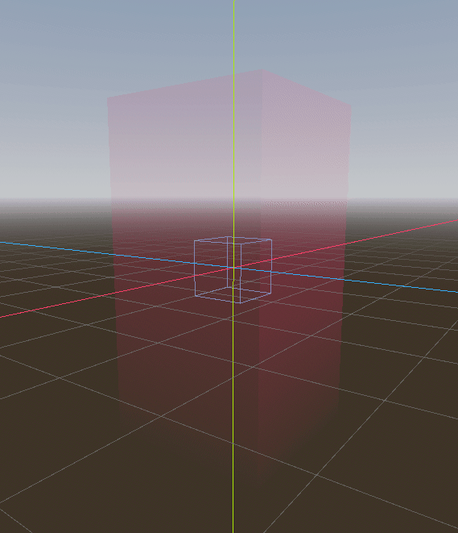

# GalaxyGravity
Into the deep end with game development! In an effort to get properly started with game dev and to stop making excuses, I've decided to make clones of some common and fairly popular games and game genres. For the 3D portion, I have initially decided to work with the Godot engine as it seems to be a very friendly environment, open source, free, and fun to use. I hope to later delve into Unreal Engine due to a personal soft-spot for the engine and the products it has produced, but for now to learn, Godot shall be my rock. Since this was my first foray into 3D with actual physics, I wanted to focus not on a full game but rather an interesting mechanic to reduce the scope and instead maximize my learning experience. I settled on an experiment to partially recreate the gravity from Super Mario Galaxy thanks to [an excellent video on the subject](https://youtu.be/QLH_0T_xv3I) by the creator [Jasper](https://www.youtube.com/@JasperRLZ). I highly recommend checking out the video and his others as they give some neat insight into games and their internal workings.

## Game Clone Series
This is the [fourth entry](https://github.com/kazeraniman/GameCloneIndex#galaxy-gravity) in [my series of game clones](https://github.com/kazeraniman/GameCloneIndex).

## Learning Objectives
As I have spent most of my time recently working in Unity for work, I have been away from Godot for a while and in that time Godot 4 released and I had forgotten quite a lot about the engine. As such, the main goal of this project was to refamiliarize myself with Godot after a long pause between projects and to recreate a smaller-scoped, interesting mechanic. Since this was my first foray into 3D with actual physics, there were many learning opportunities on that front to dip my feet in and get a taste for what you can do. Upon watching Jasper's video, Super Mario Galaxy's gravity seemed like a fun place to do a quick case study to see how I could potentially implement it and re-learn the engine at the same time. There is so much more to what Super Mario Galaxy has to offer to make their gravity feel good and play well but this project gave me a great opportunity to learn, get in-and-out quickly to focus on a particular mechanic, and to know what I want to focus on in future 3D projects. One additional thing which I have not gotten a chance to practice much in my previous projects but work has given me a much greater appreciation for is tooling to make iteration faster and smoother. I wanted to use this opportunity to build my own shaders (I have only made minor edits to other shaders prior to this) and to use them to highlight the gravity fields in editor to make it easy to create a functioning level. With this main and side goal in mind, I set about making a quick little janky demo.

## Result
As this is just an experiment, starting the game immediately throws you in with no fancy title screen or anything.  

The two types of gravity shapes supported are sphere and parallel fields. Spheres draw you toward the centre whereas parallel fields pull you in a single direction. The world has a mix of them, and the parallel fields in particular are rotated to allow for walking on walls and on the ceiling to sell the aspect of shifting gravity. The character can walk and jump across the platforms until they get to the end but in case they or the game messes up, the reset button is available to start over. While the world isn't particularly large, it shows off the main premise and with the pretty skybox and the character animations it makes for a cute experience. There is no real win condition present; you just play around until you close the game.

In order to make level design easier, I wrote a couple simple shaders to show the area of influence of the gravity fields. They were not intended to be complex (especially as they are 3D and I don't even have proper experience with shaders in 2D) but they get the job done.

You can see in the editor how it makes life much easier to be able to see the fields and how they operate.

The gravity field scripts are set up in such a way that changing the size of the field automatically changes the size of the collider and the shader mesh as well, reducing the adjustment of fields down to a single edit thanks to some @tool annotations.

I also added a hotkey to allow for the shaders to be visible while playing the game to ensure things were working as I expected.

## Controls
The controls support both gamepad as well as mouse and keyboard. I would recommend gamepad for the best experience but YMMV.

**Gamepad**:  
*Look Around*: Right Stick  
*Move*: Left Stick / D-pad  
*Jump*: Button 0 (Bottom action / Sony Cross / Xbox A / Nintendo B)  
*Reset*: Button 6 (Start / Xbox Menu / Nintendo +)  
*View Gravity Fields*: Button 4 (Back / Sony Select / Xbox Back / Nintendo -)  

**Mouse and Keyboard**:  
*Look Around*: Left mouse button + Mouse movement  
*Move Left*: Left arrow key / A  
*Move Right*: Right arrow key / D  
*Move Up*: Up arrow key / W  
*Move Down*: Down arrow key / S  
*Jump*: Spacebar  
*Reset*: Enter  
*View Gravity Fields*: Quote left (Tilda key)  

## Resource Attribution

All resources which were not my creations are attributed in [ATTRIBUTION.md](ATTRIBUTION.md).
